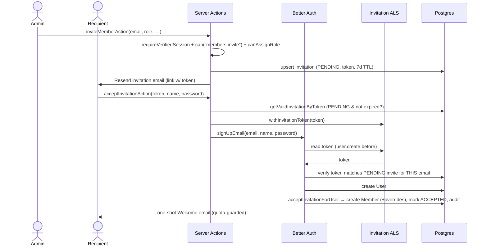
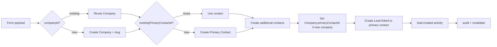
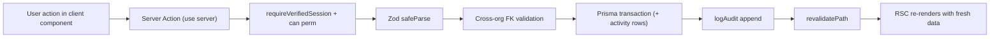

# PROJECT_CONTEXT.md

> Single-source onboarding document for **Draft To Brand — Agency OS** (`dashboard`).
> Goal: a senior engineer or AI can understand the entire application without reading the source.
> Everything below was derived directly from the codebase as of commit `574aa96` (branch `master`).
> Where something is not present, it is explicitly marked **"Not found in codebase."**

---

## 1. Project Overview

**What this product is**
Draft To Brand (DTB) is the internal **Agency Operating System** for a digital-marketing / brand-management agency ("Draft To Brand — Digital Marketing & Brand Management Agency", see [brand.ts](src/lib/constants/brand.ts)). It is a multi-tenant, single-Next.js-app **CRM + workforce/RBAC platform**. The codebase is built in explicit "phases" (Phase 0 → Phase 2E) visible in the Prisma schema comments and permission registry.

**Who uses it**
Agency staff, organized into an org graph: **Organization → Branch → Department → Team → Member**. Access is gated by database-driven roles (Owner, Admin, Manager, Team Lead, HR, Employee) plus per-user permission overrides. Sign-up is **invitation-only** — there is no public registration except the self-service workspace-creation onboarding for a brand-new authenticated user.

**Main business purpose**
Run the agency's sales & client lifecycle:
- Track **Companies** and **Contacts** (CRM roots).
- Work **Leads** through configurable **Pipelines / Stages**.
- Convert won leads into **Clients** (post-sale relationship).
- Manage **people** (members, roles, permissions, org structure) and an append-only **audit trail**.

**Core workflows**
1. **Onboarding** — verified user with no membership creates a workspace (seeds org graph, owner role, CRM reference data, default pipeline).
2. **Invitation → Signup** — admin invites by email; recipient accepts via tokenized link; a `Member` is materialized.
3. **CRM** — create companies/contacts, attach tags & notes.
4. **Leads** — create a lead (quick form or full "from scratch" company+contact+lead transaction), move through stages; status (`OPEN/WON/LOST`) is **derived from the stage's terminal outcome**.
5. **Conversion** — a `WON` lead converts 1:1 into a `Client`.
6. **Governance** — every mutation writes an `AuditLog`; settings let admins curate reference taxonomies and pipelines.

---

## 2. Tech Stack

### Frontend
| Concern | Choice | Notes |
|---|---|---|
| Framework | **Next.js 16.2.9** (App Router, React Server Components) | ⚠️ This is a *modified* Next 16; see [AGENTS.md](AGENTS.md). Middleware is renamed **"Proxy"** ([src/proxy.ts](src/proxy.ts)). |
| UI runtime | **React 19.2.4** + `react-dom` | React Compiler enabled (`babel-plugin-react-compiler`). |
| State management | **No global store** (no Redux/Zustand/Jotai). Server state via RSC + server actions; local state via React hooks/Context. | `ToastProvider` React Context ([toast.tsx](src/components/ui/toast.tsx)) is the only global provider. |
| Forms | **react-hook-form** `^7.79` + `@hookform/resolvers` | |
| Validation | **Zod `^4.4`** | Shared schemas in [src/lib/validators](src/lib/validators). |
| Tables | **@tanstack/react-table `^8.21`** | Wrapped by [data-table.tsx](src/components/ui/data-table.tsx). |
| Styling | **Tailwind CSS v4** (`@tailwindcss/postcss`) + CSS variables | Custom design tokens via `var(--color-*)`. |
| Icons | **@tabler/icons-react** | |
| Animation | **framer-motion `^12`** | e.g. sidebar active-item `layoutId`. |
| Utilities | `clsx`, `tailwind-merge` (`cn()` in [utils.ts](src/lib/utils.ts)), `date-fns`, `class-variance-authority`. |

### Backend
| Concern | Choice | Notes |
|---|---|---|
| Runtime | **Node.js** (Next.js server) | Uses `node:crypto`, `node:async_hooks`. |
| Framework | Next.js App Router — **Server Actions** (`"use server"`) are the primary API surface, plus a few Route Handlers. | |
| Auth | **Better Auth `^1.6`** (`betterAuth`) with Prisma adapter, email-OTP plugin, Next cookies plugin. | [server.ts](src/lib/auth/server.ts) |
| Email rendering | **@react-email/components** + **react-email** dev tooling. | |

### Database
| Concern | Choice |
|---|---|
| Database | **PostgreSQL** (provider `postgresql` in [schema.prisma](prisma/schema.prisma)). Targeted at **Neon serverless**. |
| ORM | **Prisma `^7.8`** (`@prisma/client`) with the **Neon driver adapter** `@prisma/adapter-neon` (`PrismaNeon`). Prisma 7 retired the bundled engine; adapter is mandatory ([client.ts](src/lib/db/client.ts)). |
| Migrations | Prisma Migrate (`prisma/migrations/*`). |

### Infrastructure / Third-party
| Concern | Choice | Notes |
|---|---|---|
| Deployment | **Not found in codebase** (no `vercel.json`/CI config committed). Next.js app — Vercel is the implied target. |
| Storage / file upload | **Not found in codebase** (no Cloudinary/S3/Blob; brand logo is a `NEXT_PUBLIC_BRAND_LOGO_URL`). |
| Email transport | **Resend `^6.12`** ([resend.ts](src/lib/email/resend.ts), [send-email.ts](src/lib/email/send-email.ts)). |
| Auth providers | Email+password, **Email OTP** verification, **Google OAuth** (social provider). |
| Other (Stripe/Twilio/OpenAI/etc.) | **Not found in codebase.** |

**Path alias:** `@/*` → `src/*` (used pervasively; see [tsconfig.json](tsconfig.json)).

---

## 3. Folder Structure

This is a **single Next.js application**, *not* a monorepo. Top-level layout:

```txt
dashboard/
├── prisma/
│   ├── schema.prisma            # Single source of truth for the data model
│   ├── seed.ts                  # Seeds permissions, org, system roles, owner user
│   ├── data/countries.json      # ISO country reference seed data
│   └── migrations/              # Prisma migration history (Phase 0 → 2E)
├── scripts/                     # One-off ops scripts (tsx)
├── src/
│   ├── proxy.ts                 # Next 16 "Proxy" (middleware) — optimistic auth gate
│   ├── actions/                 # Server Actions ("use server") = the write API
│   ├── app/                     # App Router routes
│   │   ├── (auth)/              # Public auth routes: sign-in, sign-up, onboarding, no-workspace
│   │   ├── (dashboard)/         # Protected app: /dashboard/**
│   │   └── api/auth/[...all]/   # Better Auth catch-all route handler
│   ├── components/
│   │   ├── ui/                  # Design-system primitives (button, modal, table, …)
│   │   └── layouts/             # Shell, sidebar, topbar, nav-config, breadcrumbs
│   ├── emails/                  # React-Email templates + shared components
│   ├── features/                # Feature-scoped client components & queries
│   │   ├── auth/ audit/ crm/ leads/ clients/ members/ roles/ settings/
│   │   ├── branches/ departments/ teams/ onboarding/ dashboard/
│   ├── lib/
│   │   ├── auth/                # Better Auth config, session, invitations, rate-limit
│   │   ├── permissions/         # RBAC: registry, resolve, can, policy
│   │   ├── db/                  # Prisma client singleton
│   │   ├── email/               # Resend wrapper + config
│   │   ├── crm/                 # Default pipeline & reference data
│   │   ├── validators/          # Zod schemas (shared client+server)
│   │   └── constants/           # BRAND constants
│   └── types/                   # Shared TS types (navigation)
└── (config) tsconfig.json, eslint.config.mjs, postcss.config.mjs, package.json
```

### Major folder responsibilities

| Folder | Purpose | Key dependencies |
|---|---|---|
| `src/actions/*` | All mutations. Each file = one resource. Every action: `requireVerifiedSession()` → `can(perm)` → Zod parse → cross-org FK validation → Prisma txn → `logAudit` → `revalidatePath`. | `lib/auth`, `lib/permissions`, `lib/audit`, `lib/db`, `lib/validators` |
| `src/app/(auth)` | Unauthenticated flows. `layout.tsx` is the auth shell. | `features/auth`, `lib/auth` |
| `src/app/(dashboard)` | Authenticated app. `(dashboard)/layout.tsx` resolves session + permissions and renders the shell. Each route is an RSC that queries Prisma directly and passes data to a `*-page-client` component. | `lib/auth/session`, `lib/permissions`, `features/*` |
| `src/components/ui` | Headless-ish design system. No business logic. | `lib/utils` (`cn`) |
| `src/components/layouts` | Shell/sidebar/topbar; `nav-config.ts` is the single nav source, permission-gated at render. | `types/navigation`, `lib/permissions` |
| `src/features/*` | Client components (`"use client"`) and feature-local server query helpers. | `actions/*`, `components/ui` |
| `src/lib/permissions` | RBAC engine. `registry` (keys + system roles), `resolve` (effective set), `can` (request-cached check), `policy` (privilege-escalation guards). | `lib/db` |
| `src/lib/auth` | Better Auth server config, `session` helpers, invitation lifecycle, email rate-limiting, ALS invitation-token channel. | `lib/db`, `lib/email`, `lib/permissions` |
| `src/emails` | Transactional templates rendered by Resend. | `@react-email/components` |
| `prisma/` | Schema, migrations, seeds. | — |

---

## 4. Database Documentation

PostgreSQL via Prisma. **All business tables are organization-scoped.** Soft-delete is via `archivedAt` (CRM/org-graph) or status flags (members/invitations). IDs are `cuid()` except Better Auth tables, which use Better Auth-supplied string IDs.

> Source: [prisma/schema.prisma](prisma/schema.prisma).

### Better Auth tables (DO NOT modify — auth identity only)

#### User (`user`)
Auth identity; bridges to agency identity via `Member`.

| Field | Type | Required | Description |
|---|---|---|---|
| id | String (PK) | ✓ | Better Auth id |
| name | String | ✓ | Display name |
| email | String unique | ✓ | Login email |
| emailVerified | Boolean | ✓ | Gates all mutations (see `requireVerifiedSession`) |
| image | String? | | Avatar URL |
| createdAt/updatedAt | DateTime | ✓ | |

**Relations:** has many `sessions`, `accounts`, `memberships (Member)`, `userPermissions`, `auditLogs`, and "createdBy" backrefs across CRM entities.

#### Session (`session`)
| Field | Type | Req | Description |
|---|---|---|---|
| id, token(unique), expiresAt, userId | | ✓ | Session token + expiry |
| ipAddress, userAgent | String? | | Request metadata |

Belongs to `User` (cascade delete).

#### Account (`account`)
OAuth/password credential store (Better Auth). Holds `password` hash for email/password, OAuth tokens for Google. Belongs to `User` (cascade).

#### Verification (`verification`)
Better Auth OTP/token store (`identifier`, `value`, `expiresAt`).

---

### Agency identity & org graph

#### Organization (`organization`)
The tenant root. **Everything hangs off this.**

| Field | Type | Req | Description |
|---|---|---|---|
| id | cuid PK | ✓ | |
| name | String | ✓ | |
| slug | String unique | ✓ | URL/identity slug |
| logo | String? | | |
| metadata | Json? | | |

**Has many:** branches, departments, teams, members, roles, invitations, auditLogs, companies, contacts, tags, notes, industries, companySizes, leadSources, pipelines, leads, leadActivities, clients.
**Index:** `slug`.

#### Branch (`branch`)
| Field | Type | Req | Description |
|---|---|---|---|
| id, organizationId | | ✓ | |
| name, slug | String | ✓ | `@@unique([organizationId, slug])` |
| address, city, country | String? | | |
| isHeadquarter | Boolean | ✓ | default false |
| archivedAt | DateTime? | | Soft delete |

Belongs to Organization (cascade). Has many departments, teams, members, invitations.

#### Department (`department`)
Belongs to Organization (cascade) + optional Branch (`SetNull`). Fields: name, slug (`@@unique[org,slug]`), description, `archivedAt`. Has many teams, members, invitations.

#### Team (`team`)
Belongs to Organization (cascade), optional Branch & Department (`SetNull`). Fields: name, slug (`@@unique[org,slug]`), description, `teamLeadId` (String?, **not a FK relation in schema**), `archivedAt`.

#### Member (`member`)
**The agency employee profile.** All HR/business logic hangs off `Member`, never `User`.

| Field | Type | Req | Description |
|---|---|---|---|
| id | cuid PK | ✓ | |
| userId | String | ✓ | → User (cascade) |
| organizationId | String | ✓ | → Organization (cascade) |
| branchId/departmentId/teamId | String? | | → org-graph (`SetNull`) |
| roleId | String | ✓ | → Role |
| status | `MemberStatus` | ✓ | ACTIVE / INVITED / SUSPENDED / ARCHIVED |
| jobTitle, employeeCode | String? | | |
| joinedAt | DateTime | ✓ | Used to pick "active" membership (oldest) |

**Unique:** `@@unique([userId, organizationId])` — one membership per user per org.
**Owns:** companies (`CompanyOwner`), leads (`LeadOwner`), clients (`ClientOwner`).
**Lifecycle:** created via invitation accept or workspace creation; status transitions via member actions.

#### Role (`role`)
DB-driven, per-organization.

| Field | Type | Req | Description |
|---|---|---|---|
| name, slug | String | ✓ | `@@unique([organizationId, slug])` |
| description | String? | | |
| isSystem | Boolean | ✓ | Owner/Admin/etc — not deletable |
| priority | Int | ✓ | UI ordering / tie-break |

Has many members, rolePermissions, invitations.

#### Permission (`permission`)
Global registry keyed by dotted slug.

| Field | Type | Req | Description |
|---|---|---|---|
| key | String unique | ✓ | e.g. `leads.view` |
| resource | String | ✓ | e.g. `leads` |
| action | String | ✓ | view/create/edit/delete/manage/… |
| description | String? | | |

**Index:** `resource`.

#### RolePermission (`role_permission`)
Join Role↔Permission. `@@unique([roleId, permissionId])`, both cascade.

#### UserPermission (`user_permission`)
Direct user-level grant/deny override.

| Field | Type | Req | Description |
|---|---|---|---|
| userId, organizationId, permissionId | | ✓ | `@@unique([userId, organizationId, permissionId])` |
| effect | `PermissionEffect` | ✓ | **ALLOW** or **DENY** (DENY always wins) |
| reason | String? | | e.g. `invitation:<id>` |

#### AuditLog (`audit_log`)
Append-only operational trail.

| Field | Type | Req | Description |
|---|---|---|---|
| organizationId | String? | | → Organization (`SetNull`) |
| actorUserId | String? | | → User (`SetNull`) |
| action | String | ✓ | e.g. `lead.created` |
| resource | String | ✓ | e.g. `lead` |
| resourceId | String? | | |
| metadata | Json? | | |
| ipAddress, userAgent | String? | | Captured from request headers |

**Indexes:** `[organizationId, createdAt]`, `actorUserId`, `[resource, resourceId]`.
**Lifecycle:** never updated/deleted by app code (best-effort write via [audit.ts](src/lib/audit.ts)).

#### Invitation (`invitation`)
Invitation-only signup gate.

| Field | Type | Req | Description |
|---|---|---|---|
| email | String | ✓ | recipient |
| recipientName | String? | | |
| token | String unique | ✓ | secret in invite link |
| organizationId | String | ✓ | |
| roleId | String | ✓ | role applied on accept |
| branchId/departmentId/teamId | String? | | optional placement |
| permissions | Json? | | array of `PermissionKey` → applied as ALLOW overrides |
| status | `InvitationStatus` | ✓ | PENDING/ACCEPTED/REVOKED/EXPIRED/DELETED |
| expiresAt, acceptedAt, deletedAt | DateTime | | TTL = 7 days |
| createdById | String? | | → User (`SetNull`) |

**Unique:** `@@unique([organizationId, email])` — one invitation row per (org,email), revived on re-invite.
**Indexes:** email, organizationId, status.

#### EmailDeliveryLog (`email_delivery_log`)
Append-only ledger powering **all** rate-limits/cooldowns/lockouts.

| Field | Type | Req | Description |
|---|---|---|---|
| identifier | String | ✓ | lowercased email, or `invitation:<id>` |
| scope | `EmailDeliveryScope` | ✓ | which policy (see §15) |
| metadata | Json? | | forensics |

**Index:** `[identifier, scope, createdAt]` — policies compute by count+order on this index.

---

### CRM foundation (Phase 2A / 2A.5)

#### Company (`company`)
| Field | Type | Req | Description |
|---|---|---|---|
| name, slug | String | ✓ | `@@unique([organizationId, slug])` |
| website, description, city, address, phone, email | String? | | |
| status | `CompanyStatus` | ✓ | ACTIVE/PROSPECT/ARCHIVED |
| industryId, countryId, companySizeId, leadSourceId | String? | | reference-data FKs (`SetNull`) |
| ownerId | String? | | → Member (`CompanyOwner`) |
| primaryContactId | String? | | → Contact (the main POC) |
| archivedAt, createdById | | | soft delete + creator |

**Relations:** has many contacts (`CompanyContacts`), notes, tags (`CompanyTag`), leads; optional `client` (1:1).
**Indexes:** org, [org,status], [org,archivedAt], + each FK.

#### Contact (`contact`)
| Field | Type | Req | Description |
|---|---|---|---|
| firstName, lastName | String | ✓ | |
| email, phone, jobTitle, linkedinUrl | String? | | |
| notes | String? | | free-form inline card notes (distinct from `Note` model) |
| status | `ContactStatus` | ✓ | ACTIVE/ARCHIVED |
| companyId | String? | | → Company (`CompanyContacts`, `SetNull`) |

Backref `primaryOf` (companies where it's primary), tags (`ContactTag`), leads, noteEntries.

#### Tag (`tag`)
Per-org. `name` (`@@unique[org,name]`), `color` (hex, default `#6b6e6e`). Join tables **CompanyTag** (`@@id[companyId,tagId]`) and **ContactTag** (`@@id[contactId,tagId]`), both cascade.

#### Note (`note`)
First-class timeline note. `content` (`@db.Text`), optional `companyId` / `contactId` (cascade), `createdById` (`SetNull`). Indexes `[org,createdAt]`, companyId, contactId.

#### Country (`country`) — **global, system-managed**
ISO 3166-1. `name`, `iso2` (unique), `iso3` (unique), `phoneCode`. Seeded from [countries.json](prisma/data/countries.json). The only non-org-scoped business table.

#### Industry / CompanySize / LeadSource — per-org dynamic taxonomies
- **Industry**: name, slug (`@@unique[org,slug]`), `isActive`, `archivedAt`.
- **CompanySize**: + `sortOrder`.
- **LeadSource**: + `color` (hex). Has many companies **and** leads.

All three: `createdById` (`SetNull`), soft-delete via `archivedAt`/`isActive`.

---

### Lead management (Phase 2B)

#### Pipeline (`pipeline`)
name, slug (`@@unique[org,slug]`), description, `isDefault` (only one per org — enforced in action layer), `archivedAt`. Has many `stages`, `leads`.

#### PipelineStage (`pipeline_stage`)
| Field | Type | Req | Description |
|---|---|---|---|
| pipelineId | String | ✓ | cascade |
| name, slug | String | ✓ | `@@unique([pipelineId, slug])` |
| color | String | ✓ | default `#6b6e6e` |
| sortOrder | Int | ✓ | gap-numbered (×10) |
| winProbability | Int | ✓ | 0–100 |
| outcome | `StageOutcome` | ✓ | **OPEN/WON/LOST** — terminal flag that derives `Lead.status` |

#### Lead (`lead`)
| Field | Type | Req | Description |
|---|---|---|---|
| title | String | ✓ | |
| companyId, contactId, leadSourceId, ownerId | String? | | `SetNull`; ownerId→Member |
| pipelineId, stageId | String | ✓ | required FKs (no SetNull) |
| status | `LeadStatus` | ✓ | OPEN/WON/LOST — **derived from stage.outcome, never set manually** |
| priority | `LeadPriority` | ✓ | LOW/MEDIUM/HIGH/URGENT |
| estimatedValue | Decimal(14,2)? | | money |
| currency | `Currency`? | | fixed enum allowlist (USD/EUR/GBP/AUD/CAD/SGD/AED/BDT) |
| expectedCloseDate, description, archivedAt, createdById | | | |

Has many `activities`; optional `client` (1:1).
**Indexes:** org, [org,status], [org,archivedAt], [pipelineId,stageId], companyId, contactId, ownerId, leadSourceId.

#### LeadActivity (`lead_activity`)
Append-only lead timeline. `type` (e.g. `lead.created`, `stage.changed`, `owner.changed`, `lead.converted`), `message`, `metadata` Json, `createdById`. Cascade on lead delete.

---

### Client foundation (Phase 2E)

#### Client (`client`)
Post-sale relationship. **Strict 1:1 with Company.**

| Field | Type | Req | Description |
|---|---|---|---|
| companyId | String **unique** | ✓ | enforces "one Client per Company" |
| leadId | String? **unique** | | set only on lead-conversion; a lead → at most one client |
| ownerId | String? | | → Member (`ClientOwner`) |
| status | `ClientStatus` | ✓ | ACTIVE/INACTIVE |
| onboardingStatus | `OnboardingStatus` | ✓ | NOT_STARTED/IN_PROGRESS/COMPLETED |
| startDate | DateTime? | | |
| notes | Text? | | |
| archivedAt | DateTime? | | soft delete |

**Note:** `company` relation has **no `onDelete` rule** (defaults to restrict) — a Company with a Client cannot be hard-deleted.

### Enums summary
`MemberStatus`, `PermissionEffect`, `InvitationStatus`, `EmailDeliveryScope`, `CompanyStatus`, `ContactStatus`, `LeadStatus`, `LeadPriority`, `StageOutcome`, `Currency`, `ClientStatus`, `OnboardingStatus`.

---

## 5. Feature Inventory

Each feature follows the same shape: **RSC page** (queries Prisma + resolves `can()`), **`*-page-client` / dialog** components in `features/*`, **server actions** in `actions/*`, gated by **permission keys**.

### Companies
- **Purpose:** CRM account records (the agency's prospect/customer companies).
- **Capabilities:** create/edit/archive/restore, tag, set primary contact, attach notes, list contacts, link reference data (industry/size/country/source/owner).
- **Pages:** [/dashboard/companies](src/app/(dashboard)/dashboard/companies/page.tsx), [/dashboard/companies/[id]](src/app/(dashboard)/dashboard/companies/[id]/page.tsx).
- **Components:** `features/crm/companies-page-client`, `company-form-dialog`, `company-overview`, `company-detail-actions`, `company-contacts-tab`, `tag-selector`, `notes-section`.
- **Actions:** [companies.ts](src/actions/companies.ts) — `upsertCompanyAction`, `archiveCompanyAction`, `setPrimaryContactAction`.
- **Models:** Company, CompanyTag, Note, (FKs to Industry/CompanySize/Country/LeadSource/Member/Contact).
- **Permissions:** `companies.view`, `companies.manage`.
- **Related:** Contacts, Leads, Clients, Tags, Notes.

### Contacts
- **Purpose:** People at companies (or standalone).
- **Capabilities:** create/edit/archive/restore, tag, optional company link, inline notes.
- **Pages:** [/dashboard/contacts](src/app/(dashboard)/dashboard/contacts/page.tsx).
- **Components:** `features/crm/contacts-page-client`, `contact-form-dialog`, `tag-selector`.
- **Actions:** [contacts.ts](src/actions/contacts.ts) — `upsertContactAction`, `archiveContactAction`.
- **Models:** Contact, ContactTag.
- **Permissions:** `contacts.view`, `contacts.manage`.

### Leads
- **Purpose:** Active sales opportunities walking a pipeline.
- **Capabilities:** quick upsert; **"create from scratch"** (single txn: Company → Primary Contact → additional contacts → Lead); archive/restore; reassign owner; status derived from stage outcome; activity timeline; notes tab.
- **Pages:** [/dashboard/leads](src/app/(dashboard)/dashboard/leads/page.tsx), [/dashboard/leads/new](src/app/(dashboard)/dashboard/leads/new/page.tsx), [/dashboard/leads/[id]](src/app/(dashboard)/dashboard/leads/[id]/page.tsx).
- **Components:** `features/leads/*` — `leads-page-client`, `new-lead-page-client`, `lead-form-dialog`, `lead-overview`, `lead-detail-actions`, `lead-activity-timeline`, `lead-owner-reassign`, `primary-contact-selector`, plus pipeline/stage dialogs.
- **Actions:** [leads.ts](src/actions/leads.ts) — `upsertLeadAction`, `createLeadFromScratchAction`, `archiveLeadAction`, `reassignLeadOwnerAction`.
- **Models:** Lead, LeadActivity, Pipeline, PipelineStage, Company, Contact.
- **Permissions:** `leads.view`, `leads.create`, `leads.edit`, `leads.delete`, `leads.manage`, `pipelines.manage`.
- **Related:** Clients (conversion), Companies, Contacts, Pipelines.

### Pipelines & Stages
- **Purpose:** Configurable sales workflow.
- **Capabilities:** CRUD pipelines (one default per org); CRUD/reorder stages; set terminal `outcome` which **re-syncs `Lead.status` for all leads on the stage**.
- **Pages:** [/dashboard/pipelines](src/app/(dashboard)/dashboard/pipelines/page.tsx), [/dashboard/settings/pipelines](src/app/(dashboard)/dashboard/settings/pipelines/page.tsx).
- **Components:** `features/leads/pipelines-page-client`, `pipeline-form-dialog`, `stage-form-dialog`.
- **Actions:** [pipelines.ts](src/actions/pipelines.ts) — `upsertPipelineAction`, `archivePipelineAction`, `upsertPipelineStageAction`, `reorderPipelineStagesAction`, `deletePipelineStageAction`.
- **Permissions:** `pipelines.manage`.

### Clients
- **Purpose:** Post-sale relationship (1:1 with Company).
- **Capabilities:** create directly or **convert a WON Lead**; edit; archive/restore; track `status` + `onboardingStatus`.
- **Pages:** [/dashboard/clients](src/app/(dashboard)/dashboard/clients/page.tsx), [/dashboard/clients/[id]](src/app/(dashboard)/dashboard/clients/[id]/page.tsx).
- **Components:** `features/clients/*` — `clients-page-client`, `client-form-dialog`, `client-overview`, `client-detail-actions`, `convert-lead-button`.
- **Actions:** [clients.ts](src/actions/clients.ts) — `upsertClientAction`, `archiveClientAction`, `convertLeadToClientAction`.
- **Models:** Client, Company, Lead.
- **Permissions:** `clients.view/create/edit/delete/manage`.

### Tags
- **Purpose:** Cross-CRM labels for companies/contacts.
- **Actions:** [tags.ts](src/actions/tags.ts) — `upsertTagAction`, `deleteTagAction`. **Permissions:** `tags.manage`.

### Notes
- **Purpose:** First-class timeline notes on companies/contacts.
- **Actions:** [notes.ts](src/actions/notes.ts) — `createNoteAction`, `updateNoteAction`, `deleteNoteAction` (**ownership-aware**: `.own` vs `.any`).
- **Permissions:** `notes.view/create/edit.own/edit.any/delete.own/delete.any`.

### Members
- **Purpose:** Agency staff management.
- **Capabilities:** edit (role/placement/jobTitle), suspend, activate, remove (archive). Privilege-escalation & sole-Owner guards.
- **Pages:** [/dashboard/members](src/app/(dashboard)/dashboard/members/page.tsx).
- **Components:** `features/members/*` — `members-table`, `edit-member-dialog`, `member-row-actions`, `invite-member-dialog`, `invitations-table`, `invitation-edit-dialog`.
- **Actions:** [members.ts](src/actions/members.ts) — `updateMemberAction`, `suspendMemberAction`, `activateMemberAction`, `removeMemberAction`.
- **Permissions:** `members.view/invite/edit/remove`.

### Invitations
- **Purpose:** Invitation-only onboarding.
- **Capabilities:** invite (upsert per org+email), resend, cancel (REVOKED, silent), reopen, soft-delete (DELETED + token rotation), edit pending (token rotates on email change).
- **Actions:** [invitations.ts](src/actions/invitations.ts) + [accept-invitation.ts](src/actions/accept-invitation.ts).
- **Permissions:** `members.invite`.

### Roles & Permissions
- **Purpose:** RBAC administration.
- **Capabilities:** CRUD roles, clone role, assign permission subsets (cannot exceed actor's own perms). The **Permissions page is read-only** — it renders the registry grouped by resource ("Permissions are code-driven; assign them through roles"). Per-user `UserPermission` overrides are written **only** during invitation acceptance, not from any admin UI.
- **Pages:** [/dashboard/roles](src/app/(dashboard)/dashboard/roles/page.tsx), [/dashboard/permissions](src/app/(dashboard)/dashboard/permissions/page.tsx) (read-only registry view, gated by `roles.view`/`permissions.manage`).
- **Components:** `features/roles/*` — `roles-table`, `role-form-dialog`, `permission-selector`.
- **Actions:** [roles.ts](src/actions/roles.ts) — `createRoleAction`, `updateRoleAction`, `deleteRoleAction`, `cloneRoleAction`.
- **Permissions:** `roles.view`, `roles.manage`, `permissions.manage`.

### Organization graph (Branches / Departments / Teams)
- **Pages:** [/dashboard/branches](src/app/(dashboard)/dashboard/branches/page.tsx), `/departments`, `/teams`.
- **Components:** `features/branches|departments|teams/*-page-client`.
- **Actions:** [branches.ts](src/actions/branches.ts), [departments.ts](src/actions/departments.ts), [teams.ts](src/actions/teams.ts).
- **Permissions:** `branches.view/manage`, `departments.view/manage`, `teams.view/manage`, `organizations.view/manage`.
- ⚠️ Nav has a **"Workspace" → /dashboard/organization** link but **no `organization` page exists** (see §17).

### Settings / Reference data
- **Purpose:** Curate per-org taxonomies + browse countries.
- **Pages:** [/dashboard/settings](src/app/(dashboard)/dashboard/settings/page.tsx), `/settings/industries`, `/settings/company-sizes`, `/settings/lead-sources`, `/settings/countries`, `/settings/pipelines`.
- **Components:** `features/settings/*` — `industries-page-client`, `company-sizes-page-client`, `lead-sources-page-client`, `reference-list`, `settings-nav`.
- **Actions:** [industries.ts](src/actions/industries.ts), [company-sizes.ts](src/actions/company-sizes.ts), [lead-sources.ts](src/actions/lead-sources.ts).
- **Permissions:** `settings.view`, `industries.manage`, `company-sizes.manage`, `lead-sources.manage`.

### Audit Log
- **Purpose:** Compliance/operational trail + CSV export.
- **Pages:** [/dashboard/audit](src/app/(dashboard)/dashboard/audit/page.tsx); export route [audit/export/route.ts](src/app/(dashboard)/dashboard/audit/export/route.ts).
- **Components:** `features/audit/*` — `audit-filters`, `audit-pagination`, `actor-cell`, `metadata-cell`, `query.ts`.
- **Permissions:** `audit.view` (404 if missing — endpoint existence hidden).

### Dashboard Overview
- **Purpose:** Pipeline-health KPIs.
- **Page:** [/dashboard](src/app/(dashboard)/dashboard/page.tsx) — all server-side `count`/`aggregate`/`groupBy` (no rows loaded for KPIs). Falls back to a welcome screen for members without `leads.view`.
- **Components:** `features/dashboard/*` — `stat-card`, `pipeline-overview`, `lead-source-table`, `owner-leaderboard`, `recent-activity`, `format.ts`.

---

## 6. User Roles & Permissions

### Roles (seeded, per-org; editable)
Defined in [registry.ts](src/lib/permissions/registry.ts) `SYSTEM_ROLES`:

| Slug | Name | Priority | Permission set |
|---|---|---|---|
| `owner` | Owner | 100 | **`*` (all permissions)** — resolved to the full registry at seed/create time |
| `admin` | Admin | 80 | Full workspace admin (members, roles, org, CRM, leads, clients, settings, audit) |
| `manager` | Manager | 60 | Teams/depts view, CRM + leads + clients manage (no roles.manage/audit), `lead-sources.manage` |
| `hr` | HR | 50 | members.*, users.view, org-graph view, contacts.view |
| `team-lead` | Team Lead | 40 | view org graph, CRM view, notes any, leads create/edit, clients create/edit |
| `employee` | Employee | 10 | view-mostly; notes own, leads.view, clients.view |

`isSystem = true` roles cannot be deleted; the **Owner role cannot be edited** and its permission set is always the entire registry.

### Permission model (dotted keys)
Convention `<resource>.<action>`. `*.manage` is an **explicit** super-permission (NOT auto-expanded to view/create/edit/delete). Full key list is the `PermissionKey` union in [registry.ts](src/lib/permissions/registry.ts) (users, members, roles, permissions, organizations, branches, departments, teams, audit, companies, contacts, tags, notes.{view,create,edit.own,edit.any,delete.own,delete.any}, settings, industries, company-sizes, lead-sources, leads, pipelines, clients).

### Effective-permission resolution
[resolve.ts](src/lib/permissions/resolve.ts):
```
effective = (role's RolePermission keys)
            ∪ (UserPermission where effect=ALLOW)
            ∖ (UserPermission where effect=DENY)   // DENY always wins
```
Returns `Set<PermissionKey>`; empty if member missing or not `ACTIVE`.

### Access-check helpers
[can.ts](src/lib/permissions/can.ts), request-cached via React `cache`:
- `can(key)`, `canAny([keys])`, `canAll([keys])`, `requirePermission(key)` (throws `FORBIDDEN: <key>`).
- `getEffectivePermissions()` — for the active member.

### Privilege-escalation guards
[policy.ts](src/lib/permissions/policy.ts) (`"server-only"`):
- **`canAssignRole(actor, roleId)`** — Owner role reserved for Owners; otherwise the role's permission set must be a **subset** of the actor's effective set.
- **`canGrantPermissions(actor, keys)`** — you cannot grant keys you don't hold (blocks minting a higher-priv role).
- **`canManageMember(actor, targetMemberId)`** — only an Owner may modify another Owner.

### Where checks run (defense in depth)
1. **Proxy** ([proxy.ts](src/proxy.ts)) — optimistic cookie-existence gate only.
2. **Dashboard layout** ([(dashboard)/layout.tsx](src/app/(dashboard)/layout.tsx)) — redirects unauth → `/sign-in`, no-member → `/onboarding`.
3. **Server actions / route handlers** — `requireVerifiedSession()` + `can()` + cross-org FK validation. **This is the authoritative gate.**
4. **UI** — `nav-config` + per-page `can()` only *hide* affordances; never trusted for security.

**Example:** editing a member requires (a) `members.edit`, (b) `canManageMember` (not editing an Owner unless you are one), (c) `canAssignRole` (no privilege escalation), (d) `assertSameOrg` for branch/dept/team — plus a **sole-Owner self-demotion guard** ([members.ts:93](src/actions/members.ts)).

---

## 7. Authentication System

**Library:** Better Auth (`betterAuth`) configured in [server.ts](src/lib/auth/server.ts). Client in [client.ts](src/lib/auth/client.ts). Mounted at [/api/auth/[...all]](src/app/api/auth/[...all]/route.ts) via `toNextJsHandler`.

**Methods:** email+password (`autoSignIn`, min 8 / max 128 chars), **Email OTP** verification (6-digit, 10-min expiry, 5 attempts), **Google OAuth**.

**Cookies/session:** Better Auth sessions, cookie prefix `dtb`, `useSecureCookies` in production. `expiresIn` 7 days, `updateAge` 1 day, **cookie cache** 5 min. No custom JWT layer.

### Registration (invitation-only)
There is **no open signup**. The only user-creating path is `acceptInvitationAction`:
1. Recipient opens `/sign-up?token=…`. Page validates token via `getValidInvitationByToken`.
2. `InvitedSignUpForm` submits to [accept-invitation.ts](src/actions/accept-invitation.ts).
3. Action wraps the Better Auth `signUpEmail` call in `withInvitationToken(token, …)` — an **AsyncLocalStorage** channel ([invitation-context.ts](src/lib/auth/invitation-context.ts)) carrying the token into BA's DB hooks.
4. BA `databaseHooks.user.create.before` **rejects signup if no token in ALS**, and the token must match a PENDING, non-expired invitation **for that exact email**.
5. `after` hook materializes the *specific* invitation (by token, not "any by email" — fixes a multi-invite tie-break bug), creating the Member + optional permission overrides, then sends a one-shot Welcome email.

### Login
`/sign-in` → `sign-in-form` → `authClient.signIn`. Proxy bounces signed-in users away from `/sign-in` & `/sign-up`.

### Email verification gate
- OTP **not** auto-sent on signup (`sendVerificationOnSignUp: false`).
- Dashboard renders an `EmailVerificationGate` modal over everything until `emailVerified`.
- **All mutations require `requireVerifiedSession()`** — verification is enforced server-side, never trusted from the modal.
- Verify/resend go through server actions ([verification.ts](src/actions/verification.ts)) that record failures and enforce lockout server-side.

### Password reset
`emailAndPassword.sendResetPassword` → quota check (`PASSWORD_RESET_SENT`) → `sendPasswordResetEmail`.

### Session helpers ([session.ts](src/lib/auth/session.ts))
- `getAuthUser()` — user or null (no member needed).
- `getActiveMember()` — oldest ACTIVE membership (+org+role).
- `getServerSession()` — requires both user **and** member.
- `requireSession()` / `requireVerifiedSession()` / `requireVerifiedAuthUser()` (onboarding).

### User lifecycle
`User (BA)` → optional `Member` per org (INVITED→ACTIVE→SUSPENDED→ARCHIVED). "Active membership" = oldest ACTIVE (Phase 0; a workspace switcher is a future phase per code comments).

### Sequence diagram — invitation signup



---

## 8. API Documentation

The app is **action-first**: writes are React Server Actions, not REST. There are only **two HTTP route handlers**. Server Actions are listed with their contract.

### HTTP Route Handlers

#### `/api/auth/[...all]` — Better Auth catch-all
- **Methods:** GET, POST.
- **Purpose:** All Better Auth endpoints (sign-in, sign-up/email, email-otp send/verify, OAuth callbacks, session).
- **Auth:** managed by Better Auth.
- **Source:** [route.ts](src/app/api/auth/[...all]/route.ts).

#### `GET /dashboard/audit/export`
- **Purpose:** Stream org-scoped audit CSV (≤10k rows), same filters as the page.
- **Auth required:** ✓ `requireSession()` + `can("audit.view")` (else **404**, to hide endpoint).
- **Query params:** `q`, `resource`, `action` (prefix), `from`, `to` (dates).
- **Response:** `text/csv; charset=utf-8`, `Content-Disposition: attachment`, UTF-8 BOM, RFC-4180 escaped.
- **Source:** [route.ts](src/app/(dashboard)/dashboard/audit/export/route.ts).

### Server Actions (the write API)

All return a discriminated `{ ok: true; id?/data? } | { ok: false; error }`. All (except auth/onboarding/verification) call `requireVerifiedSession()` then the listed permission via `can()`, validate input with Zod, validate cross-org FKs, run a Prisma transaction where multi-step, `logAudit`, and `revalidatePath`.

| Action (file) | Purpose | Permission |
|---|---|---|
| `acceptInvitationAction` ([accept-invitation.ts](src/actions/accept-invitation.ts)) | Token-anchored signup | none (token is the gate) |
| `createWorkspaceAction` ([workspace.ts](src/actions/workspace.ts)) | Onboarding: create org + seeds | verified auth user, no existing member |
| `inviteMemberAction`, `resend/cancel/reopen/delete/updateInvitationAction` ([invitations.ts](src/actions/invitations.ts)) | Invitation lifecycle | `members.invite` |
| `updateMemberAction`, `suspend/activate/removeMemberAction` ([members.ts](src/actions/members.ts)) | Member admin | `members.edit` / `members.remove` |
| `create/update/delete/cloneRoleAction` ([roles.ts](src/actions/roles.ts)) | Role admin | `roles.manage` |
| `upsert/archiveCompanyAction`, `setPrimaryContactAction` ([companies.ts](src/actions/companies.ts)) | Companies | `companies.manage` |
| `upsert/archiveContactAction` ([contacts.ts](src/actions/contacts.ts)) | Contacts | `contacts.manage` |
| `upsert/deleteTagAction` ([tags.ts](src/actions/tags.ts)) | Tags | `tags.manage` |
| `create/update/deleteNoteAction` ([notes.ts](src/actions/notes.ts)) | Notes (ownership-aware) | `notes.create` / `notes.{edit,delete}.{own,any}` |
| `upsertLeadAction`, `createLeadFromScratchAction`, `archiveLeadAction`, `reassignLeadOwnerAction` ([leads.ts](src/actions/leads.ts)) | Leads | `leads.create/edit/delete/manage` |
| `upsert/archivePipelineAction`, `upsert/deletePipelineStageAction`, `reorderPipelineStagesAction` ([pipelines.ts](src/actions/pipelines.ts)) | Pipelines/stages | `pipelines.manage` |
| `upsert/archiveClientAction`, `convertLeadToClientAction` ([clients.ts](src/actions/clients.ts)) | Clients | `clients.create/edit/delete/manage` |
| `upsert/archive{Branch,Department,Team}Action` | Org graph | `branches/departments/teams.manage` |
| `upsert/archive{Industry,CompanySize,LeadSource}Action` | Reference data | `industries/company-sizes/lead-sources.manage` |
| `verifyEmailOtpAction`, `sendVerificationOtpAction`, `getVerificationCooldownAction` ([verification.ts](src/actions/verification.ts)) | Email verification | own-email only |

#### Example — request/response (`upsertLeadAction`)
```ts
// Request (LeadFormValues, validated by leadSchema)
{ title: "Acme rebrand", pipelineId: "ck…", stageId: "ck…",
  priority: "HIGH", companyId: "ck…", contactId: "ck…",
  estimatedValue: 12000, currency: "USD", expectedCloseDate: "2026-07-01" }

// Success
{ ok: true, id: "clz…" }
// Failure (Zod / permission / cross-org FK)
{ ok: false, error: "Pipeline not found in this workspace." }
```
**Errors are returned, not thrown** (except `requireSession`/`requireVerifiedSession` which throw `UNAUTHENTICATED` / `EMAIL_VERIFICATION_REQUIRED`). On the lead write, status is **derived** from the stage outcome and a `LeadActivity` row is recorded in the same transaction.

---

## 9. Frontend Architecture

- **Rendering:** App Router. Pages are **RSC** that fetch via Prisma and pass plain props to client islands (`features/*-page-client`, `*-dialog`). Detail/overview pages set `export const dynamic = "force-dynamic"`.
- **Route groups:** `(auth)` (public shell) and `(dashboard)` (protected shell).
- **Protected routes:** enforced at the **(dashboard) layout** (redirect logic) + per-action `can()`. Proxy provides the first optimistic gate.
- **Layouts:**
  - [app/layout.tsx](src/app/layout.tsx) — root, Inter font (`--font-display`), `<ToastProvider>`, brand metadata template.
  - [(auth)/layout.tsx](src/app/(auth)/layout.tsx) — auth shell.
  - [(dashboard)/layout.tsx](src/app/(dashboard)/layout.tsx) — resolves session + effective permissions → `DashboardShell`; mounts `EmailVerificationGate` if unverified.
- **Shell:** [dashboard-shell.tsx](src/components/layouts/dashboard-shell.tsx) — sidebar (desktop sticky + mobile `Sheet`) + topbar + main.
- **Navigation:** [nav-config.ts](src/components/layouts/nav-config.ts) is the single source; [sidebar.tsx](src/components/layouts/sidebar.tsx) filters items by the member's effective permissions (`ANY` match) — **never branch by role in components**.
- **Global providers:** only `ToastProvider` (React Context). **No** React Query/SWR/Zustand/Redux.
- **Hooks/utilities:** `cn()` ([utils.ts](src/lib/utils.ts)), `isSafeUrl`/`safeHref` ([safe-url.ts](src/lib/safe-url.ts)), `slugify` ([onboarding.ts](src/lib/validators/onboarding.ts)), dashboard formatters ([format.ts](src/features/dashboard/format.ts)).
- **Design system:** [src/components/ui](src/components/ui) barrel ([index.ts](src/components/ui/index.ts)) — button, input, textarea, select, checkbox, radio-group, switch, badge, avatar, modal, sheet, dropdown, table, pagination, tabs, skeleton, state (EmptyState), toast, label, data-table, date-picker. Styling via Tailwind v4 + CSS variables (`--color-primary` `#ff3131`, etc., mirrored in [brand.ts](src/lib/constants/brand.ts)).

---

## 10. State Management

| Mechanism | Used? | Manages |
|---|---|---|
| React Context | ✓ (only `ToastProvider`) | Toast queue/notifications |
| Server state | ✓ | Fetched in RSC; mutated via server actions + `revalidatePath`. No client cache lib. |
| React local state | ✓ | Dialog open/close, form steps, optimistic UI in `features/*` client components |
| react-hook-form | ✓ | Form field state + Zod resolver |
| Zustand / Redux / Jotai / TanStack Query | ✗ | **Not used.** |
| Request-scoped cache | ✓ | React `cache()` wraps `getAuthUser`, `getActiveMember`, `getServerSession`, `getEffectivePermissions` so repeated calls in one request don't re-query. |

There are **no custom global stores**. The architecture deliberately keeps server data on the server and re-renders via path revalidation.

---

## 11. Reusable Components (catalog)

> Location: [src/components/ui](src/components/ui). Props are TypeScript-typed; the table summarizes intent (read the file for exact prop shapes).

| Component | File | Purpose | Used by |
|---|---|---|---|
| Button | `ui/button.tsx` | CVA-variant button (primary/secondary/…) | everywhere |
| Input / Textarea / Label | `ui/input.tsx` etc. | Form fields | all dialogs/forms |
| Select / Checkbox / RadioGroup / Switch | `ui/*.tsx` | Form controls | forms |
| Badge | `ui/badge.tsx` | Status/priority chips (`variant`) | leads, clients, members |
| Avatar | `ui/avatar.tsx` | User/member avatars | topbar, leaderboards, actor cell |
| Modal | `ui/modal.tsx` | Dialog primitive | all `*-form-dialog` |
| Sheet | `ui/sheet.tsx` | Slide-over (mobile nav, side panels) | dashboard-shell |
| Dropdown | `ui/dropdown.tsx` | Menus (`preferBottom` prop) | row actions, topbar |
| Table | `ui/table.tsx` | Styled table primitives | lists |
| DataTable | `ui/data-table.tsx` | TanStack-table wrapper | members, roles, audit, CRM lists |
| Pagination | `ui/pagination.tsx` | Page controls | audit, lists |
| Tabs | `ui/tabs.tsx` | Tabbed sections | lead/company/client detail |
| Skeleton | `ui/skeleton.tsx` | Loading placeholders | lists/details |
| State (EmptyState) | `ui/state.tsx` | Empty/no-access states | detail tabs, lists |
| Toast (+Provider) | `ui/toast.tsx` | Global notifications | action feedback |
| DatePicker | `ui/date-picker.tsx` | Date selection | lead/client forms, audit filters |

Layout components: `DashboardShell`, `Sidebar`, `Topbar`, `Breadcrumbs`, `PageHeader` ([components/layouts](src/components/layouts)). Email components: `EmailLayout`, `EmailHeader`, `EmailFooter`, `EmailButton` ([emails/components](src/emails/components)).

---

## 12. Business Workflows

### Workspace creation (onboarding)
[workspace.ts](src/actions/workspace.ts) — verified user, no membership → single transaction:
`pickAvailableSlug` → Organization → **Owner role** (all permissions) → Main Branch (HQ) → Operations dept → Core Team → seed Industries/CompanySizes/LeadSources → default Sales Pipeline + 7 stages → owner Member → audit `workspace.created`. Idempotent (existing member short-circuits).

### Invitation → Member
See §7 sequence diagram. Token-anchored, atomic accept, optional per-invitation permission overrides.

### Lead creation (quick)
`upsertLeadAction`: validate refs → derive status from stage outcome → create Lead (owner defaults to current member) + `lead.created` activity → audit.

### Lead "from scratch" (Company → Contact → Lead)
`createLeadFromScratchAction` — single transaction:

Any failure rolls the whole thing back (no half-built company/lead).

### Stage move → status derivation
On lead edit, status = stage `outcome`. Editing a **stage's** outcome (`upsertPipelineStageAction`) re-runs `lead.updateMany({stageId}, {status: outcome})` so derived status stays truthful. Stage moves write `stage.changed` activity.

### Lead → Client conversion
`convertLeadToClientAction`: lead must be `WON`, have a company, not already converted, and the company must not already have a Client (1:1) → create Client (inherits lead owner) + `lead.converted` activity → audit both `client.created` (origin `lead_conversion`) and `lead.converted`.

### Company → Client (direct)
`upsertClientAction` create branch — blocks duplicate Client per company (unique `companyId` + explicit pre-check + P2002 catch).

### Note edit/delete (ownership)
`updateNoteAction`/`deleteNoteAction`: `notes.*.any` ⇒ org-wide; else author + `notes.*.own`. Scope recorded in audit metadata.

---

## 13. Integrations

### Resend (email) — the only external service wired up
- **Purpose:** Transactional email (verification OTP, invitation, password reset, welcome).
- **Used in:** auth callbacks ([emails.ts](src/lib/auth/emails.ts), [server.ts](src/lib/auth/server.ts)), invitations action, via [send-email.ts](src/lib/email/send-email.ts) + [resend.ts](src/lib/email/resend.ts).
- **Config:** `EMAIL_CONFIG` ([email-config.ts](src/lib/email/email-config.ts)) — `from`/`replyTo` from `BRAND.email`. Subjects in `EMAIL_SUBJECTS`. Tags sanitized to `[A-Za-z0-9_-]`.
- **Env vars:** `RESEND_API_KEY`, `RESEND_FROM_EMAIL`, `RESEND_REPLY_TO`.
- **Failure handling:** `sendEmail` **never throws on transport failure** — returns `{ok:false,error}`. In dev, missing `RESEND_API_KEY` logs the plaintext and returns a `dev-noop` success so flows can be tested without a key; in production a missing key returns an error. Optional Resend `idempotencyKey` supported.

### Google OAuth (Better Auth social provider)
- **Purpose:** Social sign-in.
- **Config:** `socialProviders.google` in [server.ts](src/lib/auth/server.ts).
- **Env:** `GOOGLE_CLIENT_ID`, `GOOGLE_CLIENT_SECRET` (default to `""` if unset → effectively disabled).

### Neon (Postgres driver adapter)
- **Purpose:** Serverless Postgres transport for Prisma 7.
- **Config:** `PrismaNeon({ connectionString: DATABASE_URL })` ([client.ts](src/lib/db/client.ts)).

### Not integrated (explicitly): Stripe, Twilio, OpenAI/AI, Cloudinary/S3, Clerk, Whop, queues. **Not found in codebase.**

---

## 14. Environment Variables

Keys present in `.env` (values **not** shown). Usage derived from code.

| Variable | Required | Purpose |
|---|---|---|
| `DATABASE_URL` | ✓ | Postgres/Neon connection string (Prisma adapter). Hard-throws if missing. |
| `BETTER_AUTH_SECRET` | ✓ | Better Auth signing secret. |
| `BETTER_AUTH_URL` | ✓ | Better Auth base URL. |
| `NEXT_PUBLIC_APP_URL` | ✓ | Public app origin; auth client `baseURL`, `BRAND.url`, invitation links. |
| `NEXT_PUBLIC_BRAND_LOGO_URL` | ✓ | Sidebar/email logo (`BRAND.logo`). |
| `GOOGLE_CLIENT_ID` | optional | Google OAuth (empty ⇒ disabled). |
| `GOOGLE_CLIENT_SECRET` | optional | Google OAuth. |
| `RESEND_API_KEY` | prod-required | Resend transport (dev: missing ⇒ console log). |
| `RESEND_FROM_EMAIL` | ✓ | Email `from` (`BRAND.email.from`). |
| `RESEND_REPLY_TO` | ✓ | Email `replyTo`/support. |
| `NODE_ENV` | (runtime) | Toggles secure cookies, Prisma logging, dev email noop. |
| Seed-only (optional): `SEED_OWNER_EMAIL`, `SEED_OWNER_PASSWORD`, `SEED_OWNER_NAME`, `SEED_ORG_NAME`, `SEED_ORG_SLUG` | optional | Defaults for [seed.ts](prisma/seed.ts). |

---

## 15. Background Jobs

**There is no job queue, cron, or worker system.** No BullMQ/Inngest/Vercel Cron/Quirrel. **Not found in codebase.**

What exists instead:
- **Rate-limiting / cooldown / lockout** is computed **synchronously** at request time from the `EmailDeliveryLog` ledger ([email-rate-limit.ts](src/lib/auth/email-rate-limit.ts)) — no background reaping. Policies:

| Scope | Window | Max | Cooldown | Notes |
|---|---|---|---|---|
| `VERIFICATION_OTP_SENT` | 1h | 5 | 30s | OTP send rate |
| `VERIFICATION_OTP_FAILED` | 15m | 5 | — | 5 wrong codes ⇒ 15-min lockout |
| `INVITATION_SENT` | 1h | 3 | — | per `invitation:<id>` |
| `PASSWORD_RESET_SENT` | 1h | 3 | — | per email |
| `WELCOME_SENT` | ∞ | 1 | — | one-shot ever |

- **Eager expiry transitions** happen lazily on read (`getValidInvitationByToken` flips expired PENDING → EXPIRED).
- **Ops scripts** (manual, `tsx`): `db:seed`, `db:resync-perms`, `db:seed-countries`, `db:seed-crm-defaults`, `wipe-crm.ts`, `grant-owner-verified.ts`, `send-test-email.ts` ([scripts/](scripts), package.json).

---

## 16. Security Architecture

- **Auth checks:** layered — Proxy (cookie existence) → layout (session/member redirects) → **server action `requireVerifiedSession()` + `can()`** (authoritative). UI gating is cosmetic only.
- **Verification gate:** mutations require a verified email; enforced server-side, plus a defense-in-depth BA `hooks.before` blocking direct OTP-verify hits while locked out.
- **Permission checks:** effective-set resolution with DENY-wins; privilege-escalation guards (`canAssignRole`, `canGrantPermissions`, `canManageMember`); sole-Owner protections.
- **Multi-tenant isolation:** every query is `organizationId`-scoped; every action re-validates that referenced FKs (company/contact/branch/role/etc.) belong to the actor's org before writing — **cross-org foot-gun protection** is explicit in each action.
- **Input validation:** Zod schemas shared client+server; server **always** re-parses (`safeParse`) regardless of client validation.
- **URL safety:** `optionalUrl` Zod refinement rejects non-http(s) schemes; render-time `isSafeUrl`/`safeHref` ([safe-url.ts](src/lib/safe-url.ts)) blocks `javascript:`/`data:` at the JSX boundary.
- **Invitation security:** cryptographically random 32-byte token (`randomBytes(...).base64url`); ALS-bound to the exact invitation; tokens rotated on cancel/delete/email-change; soft-delete preserves audit history while neutralizing the link.
- **Rate limiting:** ledger-based (see §15). `Retry-After`-style `retryAfterSeconds` surfaced to UI.
- **Audit:** every mutation writes an append-only `AuditLog` with actor, IP, user-agent.
- **CSV export:** capped at 10k rows; 404 (not 403) for unauthorized to avoid endpoint disclosure; RFC-4180 escaping.
- **File uploads:** **none** (no upload surface) — **Not found in codebase.**
- **Secrets:** server-only modules marked `import "server-only"`; Prisma/auth/email never imported into client bundles.

---

## 17. Current Development Status

### Fully implemented
- Better Auth (email/password, Google, email-OTP verification) + invitation-only signup.
- RBAC (registry, system roles, effective resolution, escalation guards, per-user overrides).
- Org graph: branches, departments, teams (CRUD + archive).
- Members + invitations (full lifecycle).
- CRM: companies, contacts, tags, notes (ownership-aware).
- Leads: quick + from-scratch, pipelines/stages, derived status, activity timeline, owner reassignment.
- Clients: direct create + lead conversion (1:1 with company).
- Reference data settings (industries, company sizes, lead sources) + country browser.
- Audit log + CSV export.
- Dashboard KPI overview.
- Transactional email (Resend) + ledger-based rate limiting.

### Partially implemented / inconsistent
- **Pipelines have two entry points** — `/dashboard/pipelines` and `/dashboard/settings/pipelines` (actions revalidate the settings path; default-pipeline comment points to `/dashboard/pipelines`). Reconcile.
- **Contacts have no detail route** — `notes.ts` comments `// Future: /dashboard/contacts/[id]`; contact notes revalidate the list only.
- **Per-user permission overrides have no admin UI.** The `/dashboard/permissions` page is a **read-only** registry viewer; the only `UserPermission` write in the codebase is `tx.userPermission.upsert` inside invitation acceptance ([invitations.ts:118](src/lib/auth/invitations.ts)). A grant/deny override action is **Not found in codebase** despite the `permissions.manage` key existing.

### TODO / missing
- **`/dashboard/organization` page does not exist** but nav links "Workspace" to it ⇒ 404. Either build the page or fix nav ([nav-config.ts:53](src/components/layouts/nav-config.ts)).
- No deployment/CI config, no tests, no file storage, no background jobs.
- Workspace switcher (multi-org) is stubbed conceptually (`getActiveMember` picks oldest ACTIVE; comments reference future `Session.activeOrganizationId`).

### Technical debt
- Rate-limit check+write is **not atomic** (acceptable by design; documented path to Redis INCR).
- `Team.teamLeadId` is a bare String, not an FK relation.
- `Client.company` relation has no explicit `onDelete` (defaults to restrict).
- Some actions use loosely-typed `findFirst` casts (e.g. invitation cross-org loop).

### Known issues
- "Workspace" nav 404 (above).
- Welcome email one-shot relies on ledger; HMR/double-fire is suppressed but the email-send isn't transactional with user creation.

---

## 18. Data Flow

General pattern for **every** mutation:



Per-module specifics:
- **Leads:** client form → `upsertLeadAction`/`createLeadFromScratchAction` → derive status from stage → Lead + LeadActivity in one txn → audit → revalidate `/dashboard/leads(/[id])`.
- **Clients:** convert button → `convertLeadToClientAction` → guard WON/1:1 → Client + `lead.converted` activity → audit ×2 → revalidate.
- **Members/Roles:** dialog → action → `loadActorContext` + escalation guards → Prisma update → audit → revalidate `/dashboard/members|roles`.
- **Reads (KPIs):** RSC ([dashboard/page.tsx](src/app/(dashboard)/dashboard/page.tsx)) runs parallel `count/aggregate/groupBy` directly against Prisma — no rows materialized — then maps to view models.

---

## 19. AI Handoff Context

**Read this first to be productive in <10 minutes.**

### Critical business rules (do not break)
1. **Lead.status is derived, never input.** It always equals the current stage's `outcome` (`OPEN/WON/LOST`). Changing a stage's outcome must re-sync all leads on that stage (already done in `upsertPipelineStageAction`).
2. **Client ⟷ Company is strictly 1:1** (`companyId @unique`). A lead converts to at most one client (`leadId @unique`). Always pre-check + catch P2002.
3. **Signup is invitation-only.** The only user-creating action is `acceptInvitationAction`. The BA `user.create.before` hook rejects any signup lacking a valid invitation **token in ALS** matching a PENDING invite **for that email**. Never bypass `withInvitationToken`.
4. **Every mutation must:** `requireVerifiedSession()` → `can(permission)` → Zod parse → **validate cross-org FKs** → transaction → `logAudit` → `revalidatePath`. Copy an existing action; don't invent a new shape.
5. **Permissions: DENY wins.** `*.manage` is **not** auto-expanded — check the exact key(s) the action needs (note how lead actions check both `leads.edit` and `leads.manage`).
6. **Privilege escalation guards are mandatory** for member/role/invitation mutations (`canAssignRole`, `canGrantPermissions`, `canManageMember`). The Owner role is full-registry and uneditable; only Owners touch Owners.

### Important architectural decisions
- **Better Auth tables (`User/Session/Account/Verification`) are auth-only — never attach business logic or rename them.** Agency identity lives on `Member` and downstream.
- **Single Next.js app, action-first.** Don't add REST endpoints unless you need streaming/files (like the audit CSV).
- **No client state library.** Mutate via server actions + `revalidatePath`; don't add React Query/Zustand without cause.
- **Prisma 7 requires the Neon adapter** — the client singleton is in [client.ts](src/lib/db/client.ts); import `prisma` from `@/lib/db`.
- **Next 16 is modified** (see [AGENTS.md](AGENTS.md)) — middleware is `src/proxy.ts`; route props (`params`, `searchParams`) are **async/awaited**. Read `node_modules/next/dist/docs/` before using unfamiliar APIs.

### Hidden coupling / non-obvious wiring
- **AsyncLocalStorage** ([invitation-context.ts](src/lib/auth/invitation-context.ts)) carries the invitation token across the Better Auth async boundary into DB hooks — not headers, not a DB-by-email lookup (that lookup was the source of a multi-invite tie-break bug).
- **`EmailDeliveryLog` is one table powering all email throttling** — verification send/fail, invitation, password reset, welcome one-shot. Adding a new throttled email = add a `EmailDeliveryScope` enum value + a policy.
- **Lead detail page** ([leads/[id]/page.tsx](src/app/(dashboard)/dashboard/leads/[id]/page.tsx)) deliberately includes the lead's **archived** pipeline so the edit modal can force an explicit reassignment.
- **Nav permission gating** is ANY-of; security still lives in actions. Adding a nav item never grants access.
- **Notes on leads** actually attach to the linked company (or contact if no company) — the Note model isn't lead-aware.

### Common pitfalls
- Forgetting cross-org FK validation ⇒ tenant data leak. Every action that accepts an id must verify it's in `session.member.organizationId`.
- Setting `Lead.status` directly ⇒ drift from stage outcome.
- Editing/deleting the Owner role or seeded system roles ⇒ blocked; handle the error path.
- Trusting the verification modal for security ⇒ always `requireVerifiedSession()`.
- Building a "Workspace" page expecting an existing route — `/dashboard/organization` is referenced but absent.
- Adding `*.manage` and expecting view/create to follow — they don't; grant each key.

---

## 20. Executive Summary

**Draft To Brand — Agency OS** is a single, multi-tenant **Next.js 16 (App Router, React 19)** application that serves as a digital-marketing agency's internal operating system: a CRM (Companies, Contacts, Leads, Pipelines, Clients) layered on a full **workforce + RBAC** platform (Organizations, Branches, Departments, Teams, Members, Roles, Permissions) with an append-only audit trail.

**Core architecture.** It is **action-first**: writes are React Server Actions in `src/actions/*`, each following a strict pipeline — verified-session gate → permission check → Zod validation → cross-org FK validation → Prisma transaction (with activity rows) → audit log → path revalidation. Reads happen in RSC pages that query Prisma directly and hand plain props to client islands in `src/features/*`. There is **no global client store** and **no job queue**; the only external services are **Resend** (email) and **Google OAuth**, with **Better Auth** owning identity and **Prisma 7 + Neon Postgres** owning data.

**Main entities.** `Organization` is the tenant root; everything is `organizationId`-scoped. `User` (Better Auth) bridges to `Member` (the agency profile, unique per user+org). RBAC = `Role` × `Permission` (dotted keys) with `RolePermission` grants and `UserPermission` ALLOW/DENY overrides (DENY wins). CRM roots are `Company` and `Contact`; `Lead` walks `Pipeline`/`PipelineStage` (status **derived** from stage outcome) and converts **1:1** into `Client`. `AuditLog` and `EmailDeliveryLog` are append-only ledgers.

**Key workflows.** (1) A verified user self-creates a workspace (seeds org graph, owner role, CRM taxonomies, default pipeline). (2) Admins invite by email; recipients accept via a **token-anchored, invitation-only** signup that materializes a Member. (3) Reps create leads (quick or full company+contact+lead transaction), move them through stages, and convert won leads to clients. (4) Every change is audited; settings let admins curate taxonomies and pipelines.

**Important implementation details.** Signup is impossible without a valid invitation token threaded through **AsyncLocalStorage** into Better Auth's DB hooks. Email abuse protection (cooldowns, windows, lockouts, one-shot welcome) is computed synchronously from a single `EmailDeliveryLog` table. Multi-tenant safety is enforced by re-validating every foreign key against the actor's org in each action. Privilege-escalation guards prevent minting or assigning roles beyond one's own permissions, and the Owner role is full-registry and immutable. Known gaps: a `/dashboard/organization` nav link with no page, duplicate pipeline routes, no tests/CI/file-storage/background jobs.

> **Sources of truth to trust over this doc if they ever diverge:** [prisma/schema.prisma](prisma/schema.prisma) (data model), [src/lib/permissions/registry.ts](src/lib/permissions/registry.ts) (permissions & roles), [src/actions/*](src/actions) (business logic), [src/lib/auth/server.ts](src/lib/auth/server.ts) (auth config).
